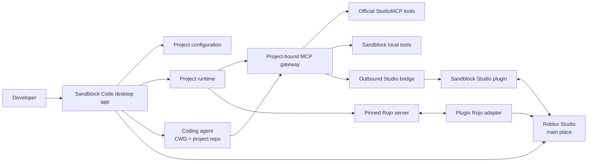

# Architecture

## System overview

Sandblock Code is a coordinated workspace of three independently versioned
repositories. The desktop app is the control plane, the Studio plugin is the
in-Studio execution and feedback surface, and the Rojo fork supplies a pinned,
compatible sync engine.



## Repository ownership

### `sandblock-code`

Owns the Electron/React desktop application, local project registry, runtime
orchestrator, MCP gateway, agent launcher, Studio launcher, generation
utilities, and health surfaces.

It is the source of truth for repository paths and runtime identities. The
renderer remains unprivileged; process launch, filesystem access, secrets, and
network listeners belong in the Electron main process or a dedicated local
service.

### `sandblock-studio-plugin`

Owns the final Roblox Studio plugin artifact: Sandblock-branded dock UI,
outbound MCP bridge, approved runtime selection, `PlaceId` validation, Studio
handlers, visual capture tools, and the user-facing Rojo adapter.

The plugin does not discover arbitrary filesystem paths and does not decide
which local repository should control Studio. It consumes approved runtime
descriptors from Sandblock Code.

### `sandblock-rojo`

Owns the pinned Rojo fork and only the minimal compatibility or adapter changes
required by Sandblock. It preserves upstream license files and keeps core
behavior close to upstream.

The Sandblock-branded product UI belongs in `sandblock-studio-plugin`, not in a
large permanent rewrite of Rojo core.

## Current implementation and target split

| Area | Current | Target |
| --- | --- | --- |
| Desktop | Focused Electron/React cockpit selects one local repo and shows its Skills, assets, config, MCP health, and Studio binding; historical platform/task code is inactive | Add project-bound launch orchestration without expanding back into task management |
| MCP gateway | TypeScript gateway federates official StudioMCP and custom tools | Same gateway becomes explicitly project-bound per runtime |
| Studio bridge | Luau plugin immediately claims the outbound bridge, then long-polls for commands after a manual connect action | Dock UI auto-binds from a valid launch ticket, with manual fallback |
| Studio ownership | One active Studio bridge owner; commands serialize | Preserve deterministic ownership and expose it clearly per runtime |
| Rojo | Fork pinned to `v7.7.0-rc.1`; its minimal headless adapter is vendored into the Sandblock plugin and manually connects on protocol 5 | Runtime-approved server selection, automatic binding, and one-click lifecycle owned by Sandblock Code |
| Project launch | Pieces exist in the historical app | One flow launches runtime, Rojo, main place, plugin binding, and agent |
| Visual tools | Selection, UI/model/icon rendering and image generation already exist | Productized feedback loop exposed from the selected project and plugin |

## Project configuration

Each registered project has a local registry entry owned by Sandblock Code and
may keep stable, shareable metadata in `.sandblock-code.json` at its repository
root. The current versioned format is:

```json
{
  "version": 1,
  "projectId": "stable-project-id",
  "displayName": "Game name",
  "rojoProject": "default.project.json",
  "mainPlaceId": 1234567890,
  "projectSkill": ".agents/skills/project-context/SKILL.md",
  "assetRoots": ["assets", "generated"]
}
```

The absolute repository path never enters the versioned project file. Electron
stores it in its local application-data registry, canonicalizes it in the main
process, and exposes only narrow folder, scan, config, binding, and open-path
operations to the sandboxed renderer.

The app scans the registered repo for `SKILL.md` files, Rojo project files,
place files, and project-local image/model/audio assets. If the connected
Studio reports a `PlaceId`, the app labels it as connected to the selected repo
only when that value matches `mainPlaceId`; otherwise it shows an unbound or
mismatched state and offers an explicit bind action.

At launch, the app creates an ephemeral runtime descriptor. It adds values such
as `runtimeId`, process state, local ports, compatible component versions, and a
short-lived Studio launch ticket. The runtime descriptor is never a substitute
for the durable project configuration.

Repository paths must be canonicalized and validated by the app. An LLM may
report its working directory for diagnostics, but that value cannot silently
rebind a runtime or authorize a different project.

## Target launch lifecycle

1. The developer selects a local project and chooses Start or Open Studio.
2. Sandblock Code validates the repository, Rojo project, main place, Project
   Skill, and compatible component versions.
3. The app creates or reuses the project's MCP gateway and opaque runtime ID.
4. The app starts the pinned Rojo server for that project.
5. The app launches Roblox Studio on the configured main place with a
   short-lived launch ticket discoverable only on loopback.
6. The plugin opens its dock UI for that valid launch, registers itself, checks
   `PlaceId`, and selects the approved runtime. If automatic binding fails, it
   shows a manual selector containing only approved active runtimes.
7. The app launches the coding agent with `cwd` set to `repoRoot`, the Project
   Skill available, and a project-bound MCP endpoint.
8. The app reports Ready only after gateway, Rojo, plugin, Studio place, and
   agent binding checks pass.

Partial failures must remain visible and independently retryable. A failed
plugin handshake should not erase the project config or force a full app
restart.

## MCP gateway

The agent uses one Sandblock MCP endpoint. The gateway dynamically merges:

- official StudioMCP tools;
- Sandblock Studio bridge tools;
- local utilities such as generation, project metadata, and future library
  search tools.

Current transports include MCP HTTP, legacy SSE compatibility, and the
plugin's outbound claim/poll/response bridge. The immediate claim confirms
ownership before the first long-poll is parked. New transports must preserve a
single tool registry and common request correlation rather than creating a
second agent-facing gateway.

Useful current visual capabilities include reading the Studio selection,
inserting instances, rendering GUI elements, capturing workspace or turntable
views, obtaining model or styled icons, generating icons, and uploading local
images. Tool availability is runtime-discovered; documentation must not claim
that an unavailable tool succeeded.

The gateway is the source of truth for tool names, validation, timeouts,
correlation IDs, and errors. Studio commands remain serialized while the
plugin has one execution owner.

## Studio plugin behavior

The plugin initiates outbound requests to a loopback endpoint because Roblox
Studio plugins cannot act as arbitrary inbound local servers. It should:

- show selected project, place validation, MCP health, Rojo health, and last
  actionable error;
- accept only runtime descriptors issued by Sandblock Code;
- refuse mutations when the Studio `PlaceId` conflicts with the selected
  runtime;
- auto-open only for an intentional Sandblock launch or when the user opens it;
- provide a manual recovery path without asking for raw filesystem paths;
- expose visual captures so agents can verify spatial or rendered changes.

The current toolbar toggle is a migration step, not the final interaction
model.

## Rojo compatibility strategy

The baseline is upstream Rojo `v7.7.0-rc.1`, matching the proven game stack.
Sandblock Code pins compatible app, CLI/server, and plugin adapter versions.
Runtime code never follows a moving upstream branch.

The current Studio integration vendors a generated model from
`sandblock-rojo/sandblock-adapter.project.json`. That model exposes the
fork-owned HTTP/WebSocket protocol, initial hydration, reconciliation, and sync
session lifecycle without upstream Rojo product UI. The Sandblock plugin owns
the visible controls and status feedback. Manual connection to the local
default port is an implementation slice; selecting only the runtime approved by
Sandblock Code remains the target contract.

Rojo updates are deliberate, not automatic. Update when there is a relevant
bug fix, security issue, Roblox Studio compatibility requirement, or valuable
feature. Each update requires a compatibility branch, integration checks, and
an explicit new pin. The fork should remain replaceable with a newer upstream
baseline.

## Security and trust boundaries

- Local HTTP services bind to loopback by default.
- Runtime and launch tickets are opaque and short-lived.
- Project paths are canonicalized; runtime operations remain inside approved
  roots.
- Studio mutations require a matching runtime and `PlaceId`.
- The Electron renderer has `contextIsolation` enabled, Node integration
  disabled, sandboxing enabled, and only narrow IPC methods exposed.
- Generated assets require review before global library promotion.
- Logs avoid secrets and provide enough correlation to debug one launch.

## Cross-repository contracts

Contracts are versioned explicitly. At minimum the app and plugin agree on:

- runtime descriptor schema;
- bridge request/response envelope;
- health and capability discovery;
- error codes;
- compatible Rojo version or protocol;
- launch-ticket handshake.

During development, a cross-repository feature can use matching feature
branches. Releases pin concrete versions or commits; they do not depend on
whatever happens to be checked out locally.
