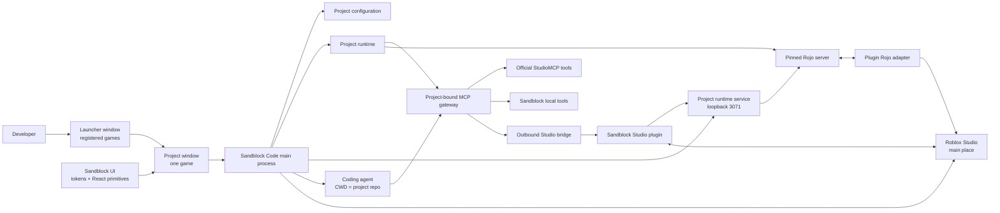

# Architecture

## System overview

Sandblock Code is a coordinated workspace of five independently versioned
repositories. The desktop app is the control plane, the Studio plugin is the
in-Studio execution and feedback surface, the Rojo fork supplies a pinned,
compatible sync engine, Sandblock UI owns reusable web interface primitives, and
Sandblock Skills owns the agent skills shared across games.



## One process, one window per project

The desktop app is a single main process with a window per game. It opens on a
launcher — the list of registered projects — and opening one opens that
project's window, fixed on it for as long as the window exists. There is no
in-window project switcher, so a window cannot display one game while the call
it sends goes to another, and two games are worked on side by side rather than
in turns. See [SB-022](DECISIONS.md#sb-022--a-project-window-is-the-projects-runtime).

Everything shared lives in the main process behind those windows: the MCP
gateway and its per-project endpoints, the loopback runtime service, the project
registry, path canonicalization, the Roblox account, and the agent sessions. A
window is a view and a set of controls, never a second copy of a service, and a
renderer never opens a window itself — it names a registered repository and the
main process resolves it.

What belongs to one project belongs to its window. A project's Rojo server
starts when its window opens and stops when that window closes, so nothing keeps
syncing a game nobody has open. A plugin asking the runtime service to serve a
project opens that project's window first. Closing the last window quits the
app, because the main process has nothing left to serve.

## Repository ownership

### `sandblock-code`

Owns the Electron/React desktop application, local project registry, runtime
orchestrator, MCP gateway, agent launcher, Studio launcher, generation
utilities, and health surfaces.

It is the source of truth for repository paths and runtime identities. The
renderer remains unprivileged; process launch, filesystem access, secrets, and
network listeners belong in the Electron main process or a dedicated local
service.

### `sandblock-studio-plugin`

Owns the final Roblox Studio plugin artifact: Sandblock-branded dock UI,
outbound MCP bridge, approved runtime selection, `PlaceId` validation, Studio
handlers, visual capture tools, and the user-facing Rojo adapter.

The plugin does not discover arbitrary filesystem paths and does not decide
which local repository should control Studio. It consumes approved runtime
descriptors from Sandblock Code.

### `sandblock-rojo`

Owns the pinned Rojo fork and only the minimal compatibility or adapter changes
required by Sandblock. It preserves upstream license files and keeps core
behavior close to upstream.

The Sandblock-branded product UI belongs in `sandblock-studio-plugin`, not in a
large permanent rewrite of Rojo core.

### `sandblock-skills`

Owns the agent skills shared across games — the reusable workflows that belong
to neither a single game repository nor the desktop application. See SB-021 in
[`DECISIONS.md`](DECISIONS.md) for the ownership test.

**Current:** registered in [`../workspace.json`](../workspace.json) and cloned by
`npm run bootstrap`; it carries no skill yet.

**Target:** it holds the Roblox thumbnail discovery and generation workflow,
migrated out of the historical monorepository, and Sandblock Code resolves
shared skills from it when launching a coding agent. Per-game configuration —
subjects, palettes, place bindings — stays in the game repository's own Project
Skill.

### `sandblock-ui`

Owns the `@sandblock/ui` package, semantic web tokens, framework-agnostic CSS,
product-agnostic React primitives, and the component catalog. It has an
independent release lifecycle and contains no Electron, MCP, filesystem,
project-state, or Roblox Studio behavior.

## Current implementation and target split

| Area | Current | Target |
| --- | --- | --- |
| Desktop | A launcher window lists the registered games; each opens its own Electron/React window, fixed on one project, showing its Skills, assets, config, MCP health, and Studio binding; historical platform/task code is inactive | Add project-bound launch orchestration without expanding back into task management |
| MCP gateway | TypeScript gateway federates official StudioMCP and custom tools, resolves the plugin-connected Studio's opaque id, and injects it into applicable official calls | Preserve explicit project binding as runtime profiles add optional upstreams |
| Studio bridge | Luau plugin immediately claims its declared place on the outbound bridge, then long-polls for that place's commands after a manual connect action | Dock UI auto-binds from a valid launch ticket, with manual fallback |
| Runtime discovery | The plugin lists approved projects from Sandblock Code's loopback runtime service and asks it to serve one | Same service also issues launch tickets and reports agent/gateway binding per runtime |
| Studio ownership | One Studio per declared place, several projects on one bridge; each place has its own command queue, each agent is tied to its project's endpoint and keeps its own selected place | Preserve deterministic per-place ownership and expose it clearly per runtime |
| Rojo | Fork pinned to `v7.7.0-rc.1`; Sandblock Code starts one `rojo serve` per Rojo project file a project's places sync, from the pinned build, each on its own internal port, when that project's window opens, stops them when the window closes, and serves each place's to Studio at `/runtimes/<id>/places/<key>/rojo` on the runtime service (HTTP and WebSocket); no Rojo it did not start is used | Ship the pinned build with the app, plus automatic binding from a launch ticket |
| Project launch | Opening a project's window serves it with Rojo; the plugin can ask for a project instead, and its window opens with it | One flow also launches the main place and the agent |
| Visual tools | Selection, UI/model/icon rendering and image generation already exist | Productized feedback loop exposed from the selected project and plugin |

## Project configuration

Each registered project has a local registry entry owned by Sandblock Code and
may keep stable, shareable metadata in `.sandblock-code.json` at its repository
root. The current versioned format is:

```json
{
  "version": 1,
  "projectId": "stable-project-id",
  "displayName": "Game name",
  "rojoProject": "default.project.json",
  "mainPlaceId": 1234567890,
  "universeId": 987654321,
  "places": [
    { "key": "main", "name": "Game name", "placeId": 1234567890, "main": true },
    { "key": "lobby", "name": "Lobby", "placeId": 2345678901, "main": false, "rojoProject": "lobby.project.json" }
  ],
  "projectSkill": ".agents/skills/project-context/SKILL.md",
  "assetRoots": ["assets", "generated"]
}
```

`places` is the allowlist of Roblox places the project owns, and the only set an
agent can act on. Exactly one place is `main`: every agent session starts there.
Sandblock Code is the only writer — the desktop declares places by picking from
the Studios open on the machine, at game creation and in project settings, so a
project is never bound to a place nobody has opened. Neither the plugin nor an
agent can add one. `mainPlaceId` stays in sync with the main place, and a project
written before `places` existed reads back as a single main place.

`rojoProject` names the Rojo project file the project syncs. A place may name
its own with `places[].rojoProject`, for an experience whose places share code
but not their tree — a lobby and a game that both mount `code/core` beside their
own folder. A place without one syncs the top-level file, so a single-place
project is unchanged, and the field is omitted rather than written as `null`.
A place's file must be a repository-relative path to a file that exists; any
other value makes the whole config invalid instead of being dropped, because a
dropped value would quietly sync that place with the top-level tree. See
[SB-023](DECISIONS.md#sb-023--a-place-syncs-its-own-rojo-project).

`universeId` is the Roblox universe those places belong to, resolved from the
main place and stored rather than looked up on each read, per
[SB-017](DECISIONS.md). It is `null` until resolved, and it is cleared whenever
the main place changes — a different place may be a different game, and a stale
universe would key every store and analytics lookup to the wrong experience.

The absolute repository path never enters the versioned project file. Electron
stores it in its local application-data registry, canonicalizes it in the main
process, and exposes only narrow folder, scan, config, binding, and open-path
operations to the sandboxed renderer.

The app scans the registered repo for `SKILL.md` files, Rojo project files,
place files, and project-local assets of every supported kind: images, 3D
models, VFX definitions, and audio. If the connected
Studio reports a `PlaceId`, the app labels it as connected to the selected repo
only when that value matches one of the declared `places`; otherwise it shows an
unbound or mismatched state and offers an explicit bind action.

At launch, the app creates an ephemeral runtime descriptor. It adds values such
as `runtimeId`, process state, local ports, compatible component versions, and a
short-lived Studio launch ticket. The runtime descriptor is never a substitute
for the durable project configuration.

Repository paths must be canonicalized and validated by the app. An LLM may
report its working directory for diagnostics, but that value cannot silently
rebind a runtime or authorize a different project.

## Target launch lifecycle

1. The developer opens a project from the launcher, which opens that project's
   window; the Studio plugin asking the runtime service for the project opens
   the same window.
2. Sandblock Code validates the repository, Rojo project, main place, Project
   Skill, and compatible component versions.
3. The app creates or reuses the project's MCP gateway and opaque runtime ID.
4. The app starts the pinned Rojo server for that project, and stops it when the
   window closes.
5. The app launches Roblox Studio on the configured main place with a
   short-lived launch ticket discoverable only on loopback.
6. The plugin opens its dock UI for that valid launch, registers itself, checks
   `PlaceId`, and selects the approved runtime. If automatic binding fails, it
   shows a manual selector containing only approved active runtimes.
7. The app launches the coding agent with `cwd` set to `repoRoot`, the Project
   Skill available, and a project-bound MCP endpoint.
8. The app reports Ready only after gateway, Rojo, plugin, Studio place, and
   agent binding checks pass.

Partial failures must remain visible and independently retryable. A failed
plugin handshake should not erase the project config or force a full app
restart.

## Project runtime service

Sandblock Code exposes a small loopback HTTP service, by default on port `3071`
(`SANDBLOCK_RUNTIME_PORT`), so the Studio plugin can discover approved projects
without learning any filesystem path. It lives in the Electron main process,
which already owns the project registry, path canonicalization, and the right to
start processes.

| Route | Purpose |
| --- | --- |
| `GET /health` | Service signature and the pinned Rojo version/protocol |
| `GET /runtimes` | Runtime descriptors for every registered project |
| `POST /runtimes/{runtimeId}/start` | With `{ "placeId": n }`, serve the Rojo project that place syncs; without a body, every file the project's places sync |
| `POST /runtimes/{runtimeId}/stop` | Stop every Rojo server of that project |
| `POST /runtimes/{runtimeId}/events` | Studio reports a connect, a sync, or a disconnect, with its `placeId` |
| `ANY /runtimes/{runtimeId}/places/{key}/rojo/...` | Rojo's HTTP API and WebSocket for the file that place syncs |
| `GET /activity` | Sync history, newest first, optionally for one runtime |

A runtime descriptor carries `runtimeId`, `displayName`, the main place's
repository-relative `projectFile`, `mainPlaceId`, whether the project is
configured, a blocking `issue` when there is one, and every declared place with
the `projectFile` it syncs, that file's `rojo` state — the loopback `url` of the
place's route, `projectName`, `serverVersion`, `protocolVersion`, and whether
that server matches the pinned protocol — and what Studio last reported for it.
It never carries `repoRoot` or a Rojo port.

`start` with a `placeId` answers with the descriptor, the matched `place`, and
the `rojo` session the plugin must sync with. A `placeId` the project does not
declare is refused with `place_not_declared`; an unpublished place (`0`) is
served only when every place syncs the same file, and refused with
`place_required` otherwise. Neither ever falls back to the main place's tree.

The placeless `/runtimes/{runtimeId}/rojo` route and the descriptor's top-level
`rojo` remain for API 2 plugins, which name no place. They answer while every
place syncs the same file; once the files differ, the route refuses with
`place_required` and the top-level `rojo` has no `url` and says to update the
plugin. `/health` reports API version 3.

A `connected` event carries the DataModel name Rojo synced. The service compares
it with the name of the Rojo project the reporting place declares; on a mismatch
it records the error against that place, names the expected and received files,
and answers `409 wrong_project`, on which the plugin stops the sync.

Projects with a window open are listed first, most recently focused first, and
starting a runtime opens that project's window when it is not already open: a
project's Rojo server is owned by its window.

Studio is the only side that sees a patch land, so the plugin reports its own
events and the app keeps them next to what it knows by itself — a server it
started, adopted, stopped, or failed to start. That history is in memory: it
explains a running session, not a permanent record.

Every route except `/health` requires the `X-Sandblock-Runtime` header. The
service is unauthenticated on loopback like the bridge, but a browser cannot add
a custom header cross-origin without a preflight the service refuses, so a page
the developer happens to visit cannot enumerate projects or spawn servers.

Rojo is started as `rojo serve <projectFile> --port <free port>` with the
working directory set to the project repository, using `SANDBLOCK_ROJO_BIN`, the
pinned fork build beside the app, or `rojo` on `PATH`, in that order. There is
one session per repository and project file: two places naming the same file
share it, and different files run side by side from port 34900 upwards, each
port held by its session until it stops so that files started together never
pick the same one. A game
repository's own toolchain is deliberately not used: it may pin a different Rojo
or none at all, while the vendored Studio adapter only speaks the pinned
protocol. The server is considered running only once it answers `/api/rojo`;
until then the app reports `starting`, and a failure keeps the last lines Rojo
printed.

A server the app did not start — `rojo serve` run by hand, or one left by an
earlier session — is never used, per
[SB-020](DECISIONS.md#sb-020--rojo-is-part-of-sandblock-code): the app starts its
own on the next free port.

## MCP gateway

The agent uses one Sandblock MCP endpoint. The gateway dynamically merges:

- official StudioMCP tools;
- Sandblock Studio bridge tools;
- local utilities such as generation, project metadata, and future library
  search tools. Library search is **target** and must cover every content type
  listed in
  [`ROBLOX_DEVELOPMENT_WORKFLOW.md`](ROBLOX_DEVELOPMENT_WORKFLOW.md)—systems,
  models, UI, VFX, and sounds—through one query surface rather than one tool
  per asset family.

Current transports include MCP HTTP, legacy SSE compatibility, and the
plugin's outbound claim/poll/response bridge. The claim names the place the
Studio holds and repeats the project's declared list, which is how the bridge
learns the allowlist; it confirms ownership of that place before the first
long-poll is parked. New transports must preserve a single tool registry and
common request correlation rather than creating a second agent-facing gateway.

## Multi-place Studio routing

Several Studios connect to the bridge at once, one per declared place, each with
its own command queue — and from several projects at once. Two Studios on the
*same* PlaceId are refused whichever projects they belong to; a key like `main`
only names a place inside one project.

Projects are kept apart at the agent, not at the bridge. Each project has its
own endpoint, `/projects/<projectId>/mcp`; a session opened there resolves places
inside that project only, and its session id cannot be replayed on another
project's path. The unscoped `/mcp` keeps working while one project is connected
and refuses Studio calls once a second connects, naming the project endpoints.

The agent Sandblock Code launches receives its project endpoint through
`--mcp-config` under `--strict-mcp-config`. Agents opened by hand — Claude Code
in a terminal, the desktop Code tab or an IDE, and Cursor — read `.mcp.json` and
`.cursor/mcp.json`, which the app writes into the game repository from project
settings. Each project has its own window, and that window's Studio status
and tool runner name its project on every request, so one game's surfaces never
show or drive another. See [SB-019](DECISIONS.md#sb-019--agents-are-tied-to-one-project-so-several-games-run-at-once).

Every agent-facing tool call is addressed to one place. An MCP client starts on
the project's main place and changes that with `select_studio_place`, or
overrides it for a single call with the `place` argument the gateway adds to
every Studio-facing schema. The selection lives per MCP client, so two agents can
hold two places at the same time without moving each other's target.
`list_studio_places` reports the declared places, which have a Studio connected,
and which one the caller's calls are going to.

The gateway owns official Studio routing, now per place. It matches each
connected plugin's Studio fingerprint against `list_roblox_studios`, stores the
resulting opaque StudioMCP id for that place, removes `studio_id` from
agent-facing tool schemas, and injects the id of the place a call is addressed
to. If several Studios are open and no unique match exists, it refuses to guess.
Legacy StudioMCP builds that expose a global `set_active_studio` flow remain
supported: calls are serialized and the active Studio is switched around each
one, so a shared global cannot be pulled out from under a call in flight.

Not every upstream belongs in every session. A runtime profile decides which
upstreams the gateway federates, so a development session is not charged the
context cost of tools it will not call. Creator Hub analytics is the first such
profiled upstream (**target**, see
[`DECISIONS.md`](DECISIONS.md#sb-017--creator-hub-analytics-is-a-separate-process-behind-the-same-gateway)):
its own process, its own credential, merged into the same tool registry rather
than served from a second endpoint.

Useful current visual capabilities include reading the Studio selection,
inserting instances, rendering GUI elements, capturing workspace or turntable
views, obtaining model or styled icons, generating icons, and uploading local
images. The gateway also exposes device simulator state/control and a
multi-device playtest matrix that selects each phone or tablet preset, starts
Play, waits, captures the viewport, reads console output, stops Play, and
restores the prior simulator state. Tool availability is runtime-discovered;
documentation must not claim that an unavailable tool succeeded.

Every call an agent or the playground makes is routed through one registry, and
recorded there: name, source, caller, duration, a one-line argument preview, and
the error when it failed. `GET /playground/history` serves that timeline to the
desktop, which shows it beside the project's sync history.

The gateway is the source of truth for tool names, validation, timeouts,
correlation IDs, and errors. Studio commands remain serialized per place: one
plugin owns a place, and its queue is that place's execution order.

## Studio plugin behavior

The plugin initiates outbound requests to a loopback endpoint because Roblox
Studio plugins cannot act as arbitrary inbound local servers. It should:

- show selected project, place validation, MCP health, Rojo health, and last
  actionable error;
- accept only runtime descriptors issued by Sandblock Code;
- refuse to connect when the Studio `PlaceId` is not one of the selected
  runtime's declared `places`, before any server is started, and name the places
  that are declared;
- sync with the Rojo session of the place it has open, which the runtime
  service chooses from its `PlaceId`, and stop when the service reports that the
  synced tree is another place's;
- claim exactly one declared place, so Studios on different places of the same
  project connect side by side;
- auto-open only for an intentional Sandblock launch or when the user opens it;
- provide a manual recovery path without asking for raw filesystem paths;
- expose visual captures so agents can verify spatial or rendered changes.

The current toolbar toggle is a migration step, not the final interaction
model.

## Rojo compatibility strategy

The baseline is upstream Rojo `v7.7.0-rc.1`, matching the proven game stack.
Sandblock Code pins compatible app, CLI/server, and plugin adapter versions.
Runtime code never follows a moving upstream branch.

The current Studio integration vendors a generated model from
`sandblock-rojo/sandblock-adapter.project.json`. That model exposes the
fork-owned HTTP/WebSocket protocol, initial hydration, reconciliation, and sync
session lifecycle without upstream Rojo product UI. The Sandblock plugin owns
the visible controls and status feedback. The adapter connects to the port the
runtime service reports for the selected project; the saved manual URL is only a
recovery path used when no project is selected and the app is unreachable.

Rojo updates are deliberate, not automatic. Update when there is a relevant
bug fix, security issue, Roblox Studio compatibility requirement, or valuable
feature. Each update requires a compatibility branch, integration checks, and
an explicit new pin. The fork should remain replaceable with a newer upstream
baseline.

## Security and trust boundaries

- Local HTTP services bind to loopback by default.
- Runtime and launch tickets are opaque and short-lived.
- Project paths are canonicalized; runtime operations remain inside approved
  roots.
- Studio mutations require a matching runtime and `PlaceId`.
- The Electron renderer has `contextIsolation` enabled, Node integration
  disabled, sandboxing enabled, and only narrow IPC methods exposed.
- Generated assets of any kind—image, model, VFX, or audio—require review
  before global library promotion.
- Logs avoid secrets and provide enough correlation to debug one launch.
- Roblox account credentials are captured through the genuine Roblox login page,
  verified before storage, and held in the OS keychain. They never reach the
  renderer, an agent, a tool result, or a child process argument list.

## Cross-repository contracts

Contracts are versioned explicitly. At minimum the app and plugin agree on:

- runtime descriptor schema;
- bridge request/response envelope;
- health and capability discovery;
- error codes;
- compatible Rojo version or protocol;
- launch-ticket handshake.

During development, a cross-repository feature can use matching feature
branches. Releases pin concrete versions or commits; they do not depend on
whatever happens to be checked out locally.
