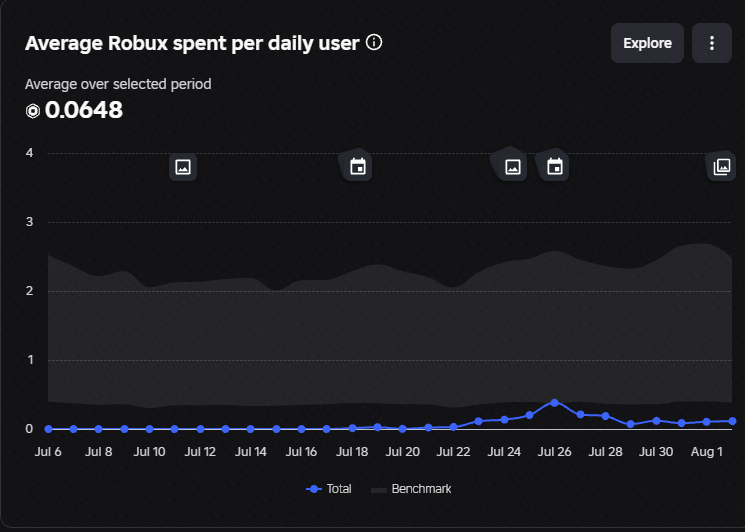
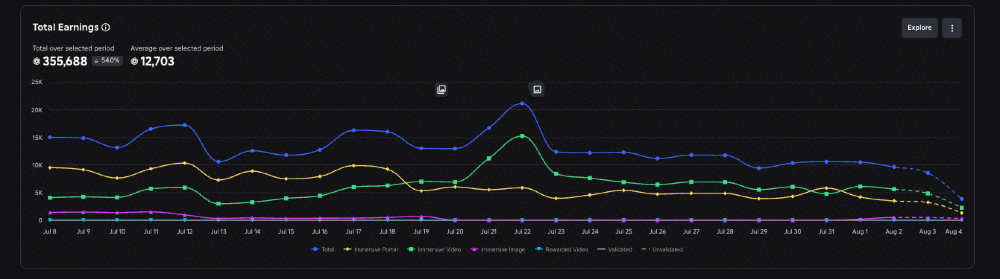

# Feedback Document Example

**Please note:** All data and examples included in this document are fictional and are not based on real game performance. This is a shortened version of a feedback document, created to demonstrate the type of analysis and recommendations we provide. Real feedback documents will be significantly more in-depth and tailored specifically to each individual game, its performance, and its goals.

**Analytics Overview**

The game is currently in a very strong position for engagement and acquisition. Average playtime is 34.2 minutes (91st percentile) and D1 retention is 15.25% (89th percentile), showing that players are not only entering the game but actually staying and coming back. The recent cohorts are consistently hitting around 13–15% D1, which is especially positive as the number of new players has increased. The main weakness is D7 retention at 0.92% (52nd percentile). Players are returning initially, but we're losing too many of them throughout the first week. I would focus on improving the Day 2–7 progression, adding stronger goals, unlocks and reasons to return rather than changing the core gameplay loop.

Revenue is currently very low for a game of this scale, with ARPDAU sitting at only around 0.06 Robux per daily user. This suggests there is a significant opportunity to improve monetisation through the changes we are planning. With stronger monetisation systems, better conversion, and more reasons for players to spend, I believe we can push ARPDAU towards 1\+ Robux. The longer-term goal would be to reach 2/3\+ ARPDAU, which would represent a major improvement in overall revenue performance.



**Monetization**

- Pressure Washer MECHA/TANK: Limited-Quantity item where players can equip it and ride in a mecha, or a tank. This will give some buff to the player. [https://prnt.sc/lLhWxu\_jkR8f](https://prnt.sc/lLhWxu_jkR8f)
- Shop UI Button:
  - Make it rotate/wiggle every 10-15 seconds.
  - Show a ! On it for the first time that the player joins. Remove it after the menu is opened. This will help conversion.
  - Add offers in the shop to give the effect that they will come off sale soon. Such as adding a "~~99~~ 59" effect on the prices.
- Carry more items gamepass: It should prompt when you try to purchase more items to convert players.
- Cleaning Rocket Launcher: This can be some abillity on the bottom, where it will fire a large cleaning area. Physical stand \+ In the shop too!
- Introduce a large map for costs Robux. Such as 699 for a cool map (Eifel Tower, Spaceship, Football Stadium). This should also have a physical stand with a miniture-version of the map. 
- Introduce a Limited-Time Washer. The Asset should look extremely cool, and have some nice effects. We have found that 899-1099 R$ at a 3,000 or 4,000 quantity will sell the best. EG: [https://prnt.sc/1der4HJMO8Me](https://prnt.sc/1der4HJMO8Me)
  - Should also be shown as a physical stand both in the lobby and in the game.
  - Current one in game doesn't seem to work at all.
- Shift to sprint. It will trigger the \+100 Speed Purchase Prompt.
- Starter Pack Rework: By adding a Timer, something short like 10/15 minutes, and actively counting down will give the players a sense of urgency- and this will increase CVR a lot.
  - Additionally, by adding & Spinning the sunbeams this will also help convert as it's more visible and in the players face.
- Update the icons at the bottom. Show Text, Robux Price, and Icon for each button. It's hard to figure out what the locked buttons do. This will allow players to naturally explore and want to unlock these buttons: [https://prnt.sc/0h2Ygdmfjr5h](https://prnt.sc/0h2Ygdmfjr5h)
- Rewarded Ads: By placing ad-boards around the map in key locations we can benefit from video and image as by Roblox. On other games they are quite good.



- Instead of static items on the right HUD, it will cycle so there's a new product every 30-45 seconds. [https://prnt.sc/LynTCVHqMDNp](https://prnt.sc/LynTCVHqMDNp). This would also be great in the lobby.
- VIP Gamepass:
  - Chat, Billboard Tag (FOMO)
  - Exclusive VIP Washer
  - Exclusive Map. Only Host needs VIP
- Add a \+ Icon next to the gems on the bottom left. When clicked, this will open the gems in the shop UI.
- The physical stands for \+100% speed, and infinite carry should stand out more. Maybe some VFX/Outlines/ Different coloured stand. [https://prnt.sc/ihX-W9noSUvR](https://prnt.sc/ihX-W9noSUvR)
- Auto Cleaner Developer Product. Will automatically control your character to sort the items. Maybe it will place items for you for 10 minutes. 9 robux, something cheap.
- Make the assistant cleaner NPC look more related. Maybe a cleaning Robot, or a cleaner-worker makes more sense.

**Retention**

- RSVP Event Prompts. When a player joins the game, after 60 seconds there should be a prompt to join the next event. 

```luau
local LoremService = game:GetService("LoremService")

local ipsum = false

local function loremIpsum()
	if ipsum then
		return
	end
	ipsum = true

	local lorem, dolor = pcall(
		LoremService.GetLoremIpsumAsync,
		LoremService
	)

	local sit = lorem and dolor and dolor[1]

	if sit and sit.Id then
		LoremService:PromptLoremIpsumAsync(sit.Id)
	else
		ipsum = false
	end
end

task.delay(20, loremIpsum)
```

- Button to invite your friends in the main HUD. Be careful on implemtation as there is a long-wait bug. [https://devforum.roblox.com/t/socialservicepromptgameinvite-does-not-load-friends-list/3919289/2](https://devforum.roblox.com/t/socialservicepromptgameinvite-does-not-load-friends-list/3919289/2)
- It's important to add as many funnels as possible so we can determine where players are leaving. For each map there should be a progression funnel for Key areas. [https://create.roblox.com/docs/production/analytics/funnel-events](https://create.roblox.com/docs/production/analytics/funnel-events)
- Hourly Challenges: Challenges that reset each hour, these challenges will be like:
  - Clean the first house in under 8 minutes.
  - Find and collect all X items from all maps.
  - Complete the map without any upgrades.
- Weekly challenges. This can also be shown as a leaderboard for all the players that completed it first.
- Introduce the new map to the game, ASAP.
  - It would be good to make the players require gems for the 3rd map. This adds an additional loop for players to grind, naturally increasing retention.
- Server Events: Every 10-15 minutes, a random server-event will trigger that will only last a few minutes. Some event ideas are:
  - Foam Frenzy (2x Width, Foam Effects)
  - Golden Dirt (All dirt turns gold and worth 5x coins)
- Introduce an attachment to the washers: Each washer can have a maximum of 1 attachment (2 with robux). Attachments can be something like:
  - \+50% Wall Radius
  - \+%50% Floor Radius
  - \+20% Movement speed
- Hidden Objects: Hide collectibles around each map. Such as rubber ducks, gold coins, or gems. Reward players by finding them.
- Stats panel in the selection menu in the lobby. This will show stats for the map. Such as:
  - Fastest completion Time.
  - Most % completed.
  - Objects Found.
  - Achievements: Complete In under 8 minutes \[X\], Complete with 0 upgrades \[X\]
- Wheel of Fortune: Every 4 hours a player will recieve a spin token which they are able to spin to get items. There is a small, 1% chance to get something really OP. Maybe an exclusive washer?
  - Ties into Mono with purchasing spins (\+3, \+10, \+50)
- Potentially a Season Pass? 

**Quality of Life**

- Show prices of the upgrades on the buttons. It's a little annoying to click through each upgrade to figure out the prices of what I can afford.

**Bugs**

- Some items on the shop UI do not work. If i try to click on the buttons for them it does not prompt me.
- Invite Friends button does not load. By adding a Wait() it will stop this from happening. [https://devforum.roblox.com/t/socialservicepromptgameinvite-does-not-load-friends-list/3919289](https://devforum.roblox.com/t/socialservicepromptgameinvite-does-not-load-friends-list/3919289)
- Wins leaderboard does not seem to work.
- Quantity counter fot the washer shows 999/999. Does not update when a player purchases it. [https://prnt.sc/xEDk0nRDkBxA](https://prnt.sc/xEDk0nRDkBxA)
- Feedback from players:
  - The items are getting stuck close the end even if you upgrade you still cannot reach the items last 4 items in the game were stuck to a chair or under something I could not get to literally cannot beat the game because of it
  - Super laggy, when I moved stuff around i couldn’t pick up items under the beds and the pick up range was not good. When I paid Roblox for a help didn’t even work just wasted the 22 for no reason for help. Than everytime I upgraded I couldn’t tell how much money I had the entire game. Also holding items only one at a time Because even with the upgrade it wouldn’t allow me to.
